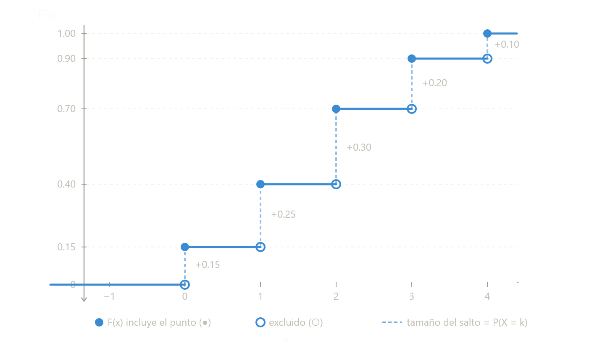
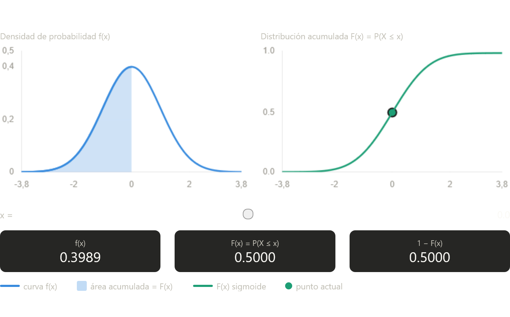

# Función Acumulada (FAP)

## Definición General

La **Función Acumulada de Probabilidad** (o **Función de Distribución Acumulada** - FDA) asocia a cada valor real $x$ la probabilidad de que una variable aleatoria $X$ tome un valor **menor o igual** que $x$. Se denota comúnmente como $F(x)$.

$$F(x) = P(X \le x)$$

Esta función es fundamental porque resume de manera completa la distribución de probabilidad de una variable aleatoria, ya sea discreta o continua.

---

## 1. Variable Aleatoria Discreta

### Definición
Para una variable aleatoria **discreta** $X$ con función de masa de probabilidad $p(x_i) = P(X = x_i)$, la función acumulada se calcula sumando las probabilidades de todos los valores menores o iguales a $x$:

$$F(x) = \sum_{x_i \le x} p(x_i)$$

### Ejemplo: Lanzamiento de un dado justo
- $X = \{1,2,3,4,5,6\}$, con $p(x_i) = \frac{1}{6}$
- $F(2) = P(X \le 2) = p(1)+p(2) = \frac{1}{6}+\frac{1}{6} = \frac{2}{6} = \frac{1}{3}$

### Gráfica (Función escalonada)
La gráfica es una **función escalonada** que:
- Permanece constante en los intervalos entre valores posibles.
- Da un "salto" de magnitud $p(x_i)$ en cada valor $x_i$.

{width=90%}

> **Nota:** El círculo relleno ● indica que el valor en el punto está incluido (por la definición $P(X \le x)$), y el círculo abierto ○ indica que no está incluido en el escalón siguiente.

---
### Propiedades de F(x)

-  $F(x) = P(X \le x)$ 
-  $P(X > x)=1-F(x)$
-  $P(X < x) = F(x) -f(x)$
-  $P(a < x \le b)=F(b)-F(a)$
-  $P(a < x < b)=F(b)-F(a)-f(b)$

---

## 2. Variable Aleatoria Continua

### Definición
Para una variable aleatoria **continua** $X$ con función de densidad de probabilidad $f(x)$, la función acumulada se define mediante la integral:

$$F(x) = \int_{-\infty}^{x} f(t) \, dt$$

### Ejemplo: Distribución Uniforme en [0,1]
$f(x) = 1$ para $0 \le x \le 1$, $f(x)=0$ en otro caso.

- Si $x < 0$: $F(x)=0$
- Si $0 \le x \le 1$: $F(x) = \int_{0}^{x} 1 \, dt = x$
- Si $x > 1$: $F(x)=1$

### Gráfica (Función continua y no decreciente)
La gráfica es una **función continua** (sin saltos) que crece suavemente.

{width=90%}

En este caso particular (Uniforme[0,1]), la función es una línea recta diagonal, pero en general puede tener formas de "S" (como en la distribución normal).

---

## Propiedades de la Función Acumulada

| Propiedad | Descripción | Implicación |
|-----------|-------------|--------------|
| **1. Acotación** | $0 \le F(x) \le 1$ para todo $x \in \mathbb{R}$ | Es una probabilidad acumulada. |
| **2. Monotonía** | Si $a < b$, entonces $F(a) \le F(b)$ | No puede decrecer; refleja acumulación. |
| **3. Límites** | $\lim_{x \to -\infty} F(x) = 0$   $\lim_{x \to +\infty} F(x) = 1$ | A la izquierda del todo es 0; a la derecha del todo es 1. |
| **4. Continuidad por la derecha** | $F(x) = \lim_{t \to x^+} F(t)$ para todo $x$ | En variables continuas es continua; en discretas tiene saltos pero siempre continua por derecha. |
| **5. Probabilidad en intervalo** | $P(a < X \le b) = F(b) - F(a)$ | Base para calcular probabilidades de intervalos. |
| **6. Relación con densidad** | Si existe $f(x)$, entonces $f(x) = \frac{d}{dx}F(x)$ casi en todas partes. | Permite pasar de acumulada a densidad. |

---

## Comparación visual entre discreta y continua

| Característica | Variable Discreta | Variable Continua |
|----------------|------------------|-------------------|
| **Forma de la gráfica** | Escalonada (saltos) | Curva suave y continua |
| **Puntos de salto** | En cada valor posible $x_i$ | No hay saltos |
| **Altura del salto** = $p(x_i)$ | No aplica |
| **Derivabilidad** | No derivable en los saltos | Derivable (casi siempre) |
| **Interpretación de $F(x)$** | Suma de probabilidades | Área bajo la curva de densidad hasta $x$ |

---

## Sintesis

La función acumulada de probabilidad es una herramienta unificadora: trabaja de manera análoga para variables discretas y continuas. Permite:

- Calcular probabilidades de intervalos de forma sencilla.
- Obtener percentiles (la inversa de la función acumulada).
- Comparar distribuciones independientemente de su tipo.

**Recuerde:** En el caso discreto la acumulación se hace por **sumas** (saltos), y en el continuo por **integrales** (áreas bajo la curva).

$$F(x) = P(X \le x) =
\begin{cases}
\sum_{x_i \le x} p(x_i) & \text{si } X \text{ es discreta} \\
\int_{-\infty}^{x} f(t)\, dt & \text{si } X \text{ es continua}
\end{cases}$$

