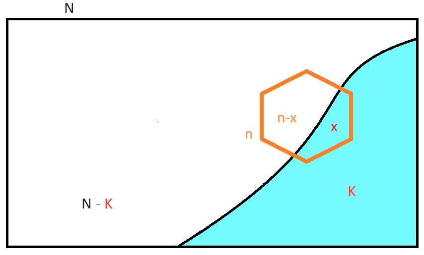
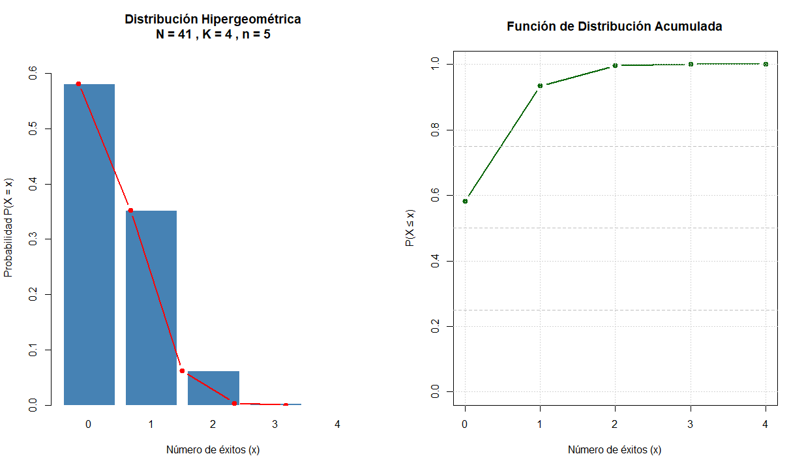
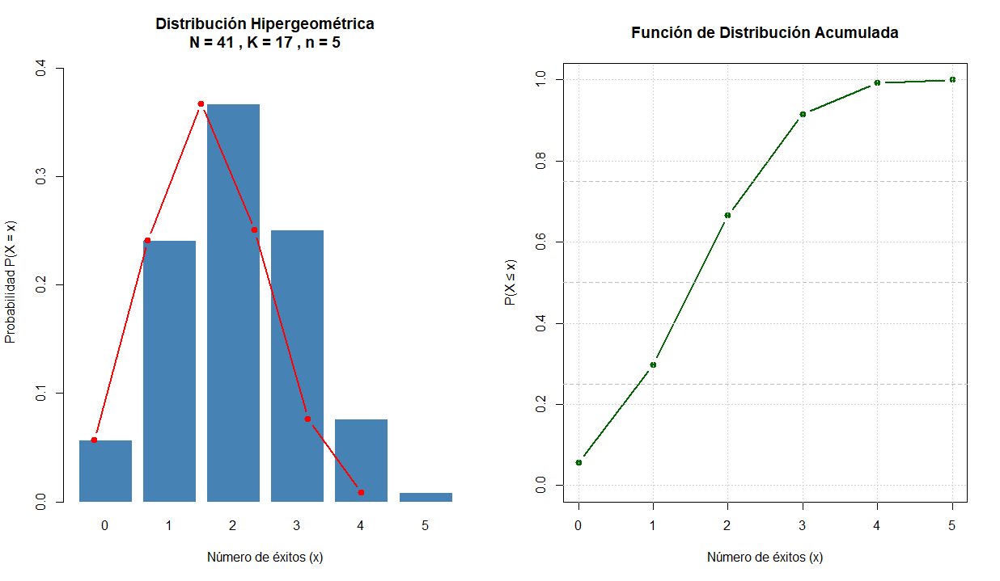

---

# Hipergeométrica


## Definición 

Describe la probabilidad de obtener un número específico de "éxitos" al extraer una muestra **sin reemplazo** de una población finita con dos categorías mutuamente excluyentes. Su estructura responde a escenarios donde la probabilidad de éxito cambia en cada extracción, violando el supuesto de independencia constante propio de otros modelos.

Su función de masa de probabilidad (FMP) se expresa como:

$$P(X = x) = \frac{\binom K x * \binom {N - K}{n - x}}{\binom N n}$$

donde:

- **N**: tamaño total de la población finita.

- **K**: número total de elementos con la característica de interés ("éxitos") en la población.

- **n**: tamaño de la muestra extraída sin reemplazo.

- **x**: número observado de éxitos en la muestra (variable aleatoria).

- $\binom a b$: coeficiente binomial "b tomados de a $a$", que cuenta las combinaciones posibles.


**Tarea**

Describa el **Soporte de la función**

Si hay $4$ éxitos, ¿X puede ser igual a $6$ ?

- Suponga que $K=5$ y $n=6$

- Suponga que $K=6$ y $n=5$


**Momentos principales**:

- Esperanza matemática: $$E[X] = n \times \frac{K}{N}$$

- Varianza: $$Var(X) = n \times \frac{K}{N} \times (1 - \frac{K}{N}) \times \frac{N - n}{N - 1}$$

El término $\frac{N - n}{N - 1}$ se denomina **factor de corrección por población finita**. Este ajuste reduce la varianza respecto a la binomial, reflejando la menor incertidumbre cuando se muestrea una proporción significativa de una población cerrada.

{width=90%}

## Uso en Ciencias Agronómicas

En estas disciplinas, la distribución hipergeométrica es metodológicamente pertinente cuando el muestreo se realiza sobre unidades discretas, finitas y sin reposición. Sus aplicaciones típicas incluyen:

- **Control de calidad en lotes de semillas**: Evaluación de la proporción de semillas viables o contaminadas en un lote certificado de tamaño conocido.

- **Inventario forestal**: Estimación de árboles infectados por patógenos en un rodal delimitado, donde cada árbol muestreado no puede ser seleccionado nuevamente.

- **Monitoreo de biodiversidad**: Detección de especies raras o amenazadas en parcelas de muestreo cerradas, especialmente cuando la población total es censada o estimada con precisión.

- **Evaluación de contaminación**: Análisis de presencia/ausencia de contaminantes en un número finito de muestras de suelo o agua extraídas de un sitio acotado.

*Intervención asistida por IA*: Las herramientas computacionales pueden calcular probabilidades hipergeométricas exactas y simular escenarios de muestreo. No obstante, el investigador debe verificar que: 

(i) la población sea efectivamente finita y conocida, 

(ii) el muestreo sea verdaderamente sin reemplazo, y 

(iii) no exista agrupamiento espacial que viole la aleatoriedad. Cuando estos supuestos se debilitan, modelos alternativos (binomial con corrección, beta-binomial o modelos jerárquicos) pueden ser más apropiados.


## Ejemplos

### Ejemplo 1: Control de Calidad - Semillas 

**Contexto**: Un lote certificado contiene N = 500 semillas, de las cuales se sabe que K = 25 presentan contaminación fúngica. Se extrae una muestra aleatoria sin reemplazo de n = 30 semillas para validación. Calcule la probabilidad de encontrar exactamente k = 2 semillas contaminadas.

**Paso 1. Identificar parámetros**: $N = 500$, $K = 25$, $n = 30$, $k = 2$.

**Paso 2. Aplicar la FMP hipergeométrica**:

$$P(X = 2) = \frac{\binom {25} 2 * \binom {475}{28}}{\binom {500}{30}}  $$
**Paso 3. Cálculo ** (usando software para evitar errores manuales):


 $$P(X = 2) ≈ (300 × 1.847e41) / 2.119e43 ≈ 0.261$$

**Paso 4. Interpretación**: Existe aproximadamente un 26.1 % de probabilidad de observar exactamente 2 semillas contaminadas en la muestra de 30, bajo las condiciones del lote.

*Verificación computacional (R)*:
```r
dhyper(x = 2, m = 25, n = 475, k = 30)
# Resultado: 0.2613
```

### Ejemplo 2: Monitoreo de Árboles Infectados 

**Contexto**: En un rodal de N = 200 pinos, se ha censado que K = 40 presentan síntomas de una enfermedad vascular. Un equipo de campo selecciona n = 25 árboles al azar sin reemplazo para análisis de laboratorio.

Calcule la probabilidad de que al menos 3 árboles muestreados estén infectados.


**Paso 1. Reformular el evento**: P(X ≥ 3) = 1 - P(X ≤ 2) = 1 - [P(0) + P(1) + P(2)].

**Paso 2. Calcular cada término con la FMP**:

- $P(0)  ≈ 0.0032$

- $P(1)  ≈ 0.0201$

- $P(2)  ≈ 0.0618$

**Paso 3. Sumar y complementar**:

$$P(X ≤ 2) ≈ 0.0032 + 0.0201 + 0.0618 = 0.0851$$

$$P(X ≥ 3) = 1 - 0.0851 = 0.9149$$

**Paso 4. Interpretación**: Existe un $91.5 \%$ de probabilidad de detectar al menos 3 árboles infectados en la muestra, lo que sugiere alta sensibilidad del protocolo de muestreo para esta prevalencia.

*Verificación computacional (Python)*:
```python
from scipy.stats import hypergeom

N, K, n = 200, 40, 25
# Probabilidad acumulada hasta 2
prob_le2 = hypergeom.cdf(2, N, K, n)
prob_ge3 = 1 - prob_le2

print(f"P(X >= 3) = {prob_ge3:.4f}")
# Salida esperada: P(X >= 3) = 0.9149
```


## Ejemplo para inferencia

Nos ofrecen **barato** un lote de 41 bultos de agroquímicos.  El vendedor establece que la **oferta** se debe a que _solo_ el $10 \%$ del lote ha cadocado.

Para mostrar la calidad del lote el vendedor permitirá que tomemos una muestra de $4$ bultos.

Si realizamos un muestreo sobre el lote de $41$ bultos tomando $4$ y se encuentran más de $3$ bultos caducos ¿Usted compra o no compra el lote?


{width=90%}


========================================

Población total (N): 41
Éxitos en población (K): 4
Tamaño muestra (n): 5
Rango de x: [0, 4]

**Probabilidades**

|X  |P(X=x)      |F(X)  |
|---|------------|------|
|0  |  5.817e-01 |0.5817 |
|1  |  3.525e-01 |0.9342 |
|2  |  6.221e-02 |0.9964 |
|3  |  3.555e-03 |1.0000 |
|4  |  4.937e-05 |1.0000 |


Media teórica: 0.4878
Varianza teórica: 0.3962


{width=90%}


## Relación con la Distribución Binomial

La conexión entre ambas distribuciones es fundamental para la toma de decisiones en el diseño experimental:

| Característica | Binomial | Hipergeométrica |
|---------------|----------|-----------------|
| **Muestreo** | Con reemplazo (o población infinita) | Sin reemplazo (población finita) |
| **Independencia** | Ensayos independientes | Probabilidad cambia en cada extracción |
| **Parámetros** | $n$, $p$ | $N$, $K$, $n$ |
| **Varianza** | $n·p·(1-p)$ | $n·p·(1-p)·[(N-n)/(N-1)]$ |

**Regla práctica de aproximación**: Cuando el tamaño muestral $n$ representa menos del 5-10 % del total poblacional $N$ (es decir, $n/N < 0.05$), el factor de corrección $(N-n)/(N-1)$ se aproxima a 1, y la distribución hipergeométrica puede aproximarse por una binomial con $p = K/N$. Esta simplificación reduce la carga computacional sin sacrificar precisión relevante.

**Consecuencias metodológicas**:

- *Diseño eficiente*: En poblaciones grandes, usar la binomial como aproximación permite aplicar pruebas e intervalos de confianza estándar.

- *Riesgo de subestimación*: Si $n/N$ es grande y se ignora el factor de corrección, se sobreestima la varianza, lo que puede conducir a intervalos de confianza innecesariamente amplios o a pérdida de potencia estadística.

- *Detección de violaciones*: La IA puede ayudar a graficar la relación entre la proporción muestral y el tamaño relativo $n/N$, alertando cuando la aproximación binomial deja de ser adecuada.


## Recomendaciones 

- **Validación de supuestos**: Confirme que la población sea finita y conocida (N), que el muestreo sea aleatorio y sin reemplazo, y que no exista estructura espacial que induzca dependencia entre unidades. Cuando la población sea grande y `n/N < 0.05`, documente explícitamente el uso de la aproximación binomial y justifique su pertinencia.

- **Manejo de sobredispersión**: Si la varianza observada supera a la teórica hipergeométrica, considere modelos que incorporen heterogeneidad no observada (beta-binomial) o efectos aleatorios espaciales.

- **Uso ético de la IA**: Las plataformas de inteligencia artificial pueden generar código, calcular probabilidades exactas y sugerir diagnósticos gráficos. Sin embargo, la interpretación ecológica-agronómica, la validación de supuestos y la trazabilidad de decisiones analíticas deben permanecer bajo criterio experto. Documente versiones de software, paquetes y criterios de selección de modelos.

- **Preguntas**:

  1. ¿Cómo modificaría el diseño de muestreo si la población N no se conoce con precisión, sino que está estimada con error?

  2. ¿Qué estrategia emplearía para distinguir entre variabilidad aleatoria y agregación espacial en conteos de especies raras?

  3. ¿En qué escenarios de monitoreo ambiental sería metodológicamente riesgoso aproximar la hipergeométrica por la binomial?


### Referencias 

- Agresti, A. (2018). *Statistical methods for the social sciences* (5.ª ed.). Pearson.

- Hilbe, J. M. (2014). *Modeling count data*. Cambridge University Press.

- R Core Team. (2025). *R: A language and environment for statistical computing*. R Foundation for Statistical Computing. https://www.R-project.org/

- SciPy Developers. (2025). *SciPy: Open source software for mathematics, science, and engineering*. https://scipy.org/

- Thompson, S. K. (2012). *Sampling* (3.ª ed.). Wiley.

- Zar, J. H. (2010). *Biostatistical analysis* (5.ª ed.). Pearson Prentice Hall.

