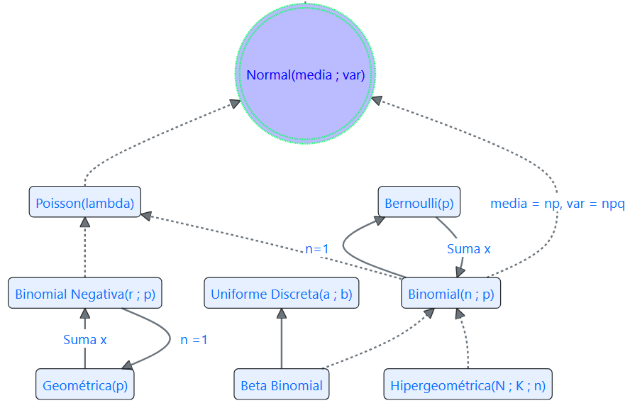

--- 
title: "Modelos de Probabilidad para v.a. Discretas"
author: "J.A. Rueda-Restrepo"
date: "2026-05-10"
site: bookdown::bookdown_site
documentclass: book
bibliography: [book.bib, packages.bib]
# url: your book url like https://bookdown.org/yihui/bookdown
# cover-image: path to the social sharing image like images/cover.jpg
description: |
  Solo con unas pocas distribuciones de probabiliadd es posible modelar muchos proceso en las ciencias agrarias.
  A excepción del modelo Hipergeométrico, los modelos se basen en ensayos beroulli independientes.
biblio-style: apalike
csl: chicago-fullnote-bibliography.csl
---

# Modelos para v.a. Discretas 

## Bernoulli 

El ensayo _Bernoulli_ constituye el bloque fundamental para la definición de los modelos de probabilidad más importantes que se expondrán aquí.

Partiremos de la definición del _ensayo Bernoulli_ para seguir con la definición de la _v.a. Bernoulli_ y luego la definición del _modelo Bernoulli_.

## Ensayo Bernoulli

Un experimento Bernoulli ocurre cuando se realizan determinaciones sobre una variable que solo se puede presentar de dos formas. Por esto, el espacio muestral asociado a tal experimento solo tiene dos eventos que se denominan, respectivamente, **Éxito y Fracaso**.

$$\Omega_{Bernoulli} =\{Éxito, \; Fracaso\}$$

De forma general, las probabilidades asociadas a los dos eventos del espacio muestral se definen como: $P(Éxito)=p$ y $P(Fracaso)=1-p=q$

## Función de probabilidad Bernoulli

Si se realiza un ensayo Bernoulli y se define la variable aleatoria, X:

Sea $X$ la v.a. que cuenta el número de Éxitos cuando se realiza un ensayo Bernoulli, entonces podemos describir la probabilidad de la v.a. como:

::: {.center}
| X | 0 | 1 |
|:-:|:-:|:-:|
| P(X=x) | $q=1-p$ |$p$ |
|:-:|:-:|:-:|
::: 

También:

$$P(X=x)=p^xq^{1-x} \;\;\; \text{para} \;x=\{0, 1\}$$
Observe que:

$$E(x)=p$$ $$Var(x)=p(1-p)=p\times q$$

{width=90%}

